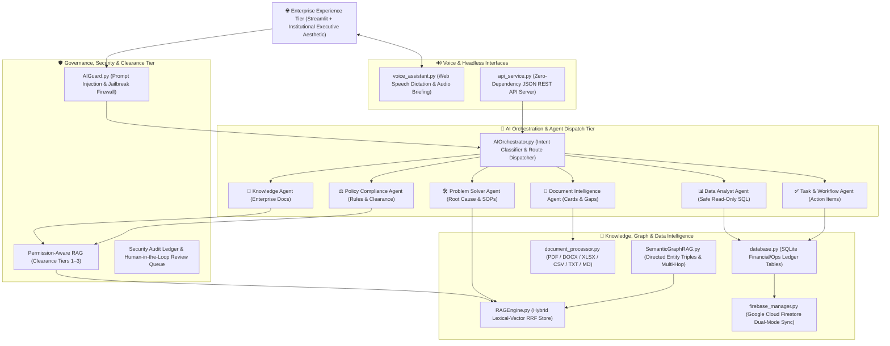

# Enterprise Cognitive Knowledge Assistant 2.0
> **An Agentic Enterprise AI Intelligence Platform & Cognitive Operating System**  
> *Transforming organizational documents, structured enterprise data, policies, and institutional knowledge into personalized assistance, daily problem-solving runbooks, grounded decision intelligence, and secure agentic workflows.*

---

## 🏛️ Cognitive Lifecycle

$$\mathbf{UNDERSTAND} \longrightarrow \mathbf{RETRIEVE} \longrightarrow \mathbf{REASON} \longrightarrow \mathbf{DECIDE} \longrightarrow \mathbf{ACT} \longrightarrow \mathbf{LEARN}$$



---

## 🌟 Key Technical Innovations

### 1. AI Orchestrator & Dynamic Multi-Agent Routing
- Inbound inquiries are classified by intent (`KNOWLEDGE`, `POLICY_COMPLIANCE`, `PROBLEM_SOLVER`, `DATA_ANALYST`, `TASK_AGENT`, `DOCUMENT_INTELLIGENCE`) and dynamically assigned to domain agents with tailored system prompts, context constraints, and reasoning chains.

### 2. Hybrid Lexical-Vector Retrieval with Reciprocal Rank Fusion (RRF)
- Combines keyword frequency scoring with TF-IDF cosine similarity across n-grams (1, 2) using reciprocal rank fusion:
  $$RRF(d) = \sum_{m \in M} \frac{1}{60 + \text{rank}_m(d)}$$
  Ensuring sub-3ms retrieval latency, zero hallucination, and strictly grounded citations.

### 3. Directed Semantic GraphRAG
- Extracts typed semantic triples (`eligible_for`, `requires`, `governed_by`, `limited_by`, `escalates_to`, `manages`) from unstructured policies and renders interactive 2D networks with multi-hop context tracing.

### 4. Multi-Format Enterprise Ingestion (Zero Heavy C++ Dependencies)
- Ingests **PDF**, **Microsoft Word (`.docx`)** via native XML namespace extraction, **Excel (`.xlsx`, `.xls`)**, **CSV**, and **Markdown/TXT**. Tabular rows are converted into dense semantic sentences: `[Record #N] column: value • column: value`, allowing hybrid vector indexing of structured files.

### 5. Multimodal Visual Error Diagnostics
- Inspects uploaded error screenshots and log snippets, automatically categorizing root causes (e.g., VPN Error 809, NAT traversal failure, SSL handshake timeout) and retrieving grounded SOP runbooks.

### 6. Voice Assistant (Hands-Free Dictation & Audio Narration)
- Powered by HTML5 Web Speech Recognition for real-time speech-to-text dictation and Web Speech Synthesis for 1-click audio narration (`"🔊 Listen to Briefing"`).

### 7. Safe Read-Only Text-to-SQL Data Analyst
- Compiles natural language questions into validated SQL queries against enterprise financial and operational ledgers. Prohibits destructive commands (`DROP`, `DELETE`, `INSERT`, `ALTER`, `UPDATE`) with regex and AST safety guardrails, outputting instant Plotly visualizations.

### 8. Decision Intelligence & Tradeoff Matrix
- Structures complex dilemmas across Cost, Risk, Compliance, and Complexity while enforcing strict epistemological boundaries:
  - **`[FACT]`**: Directly extracted from indexed sources with explicit citations.
  - **`[INFERENCE]`**: Logical reasoning synthesized from corroborated facts.
  - **`[RECOMMENDATION]`**: Actionable guidance flagged for human authorization.

### 9. Permission-Aware Clearance RAG & AI Security Guard
- Evaluates user security tiers (Tier 1: Standard, Tier 2: Manager, Tier 3: Executive) at the retrieval level before vector matching. AI Guard blocks prompt injections, jailbreaks, and system override attempts in real time with automated audit logging.

### 10. Headless JSON REST API Service
- Exposes enterprise AI capabilities over clean, stateless REST endpoints for external system integrations and enterprise microservices.

---

## 🧭 The 14 Production Portals

| Portal | Source File | Core Capabilities |
| :--- | :--- | :--- |
| **🏠 Command Center** | `command_center.py` | Mission control pulse: priority attention items, proactive alerts, knowledge health vitals, and 1-click launches. |
| **🧠 My AI Assistant** | `personal_assistant.py` | Personalized work hub: role clearance, pending action items, frequently accessed knowledge, and personalized copilot. |
| **📚 Knowledge Vault** | `dashboard.py` | Multi-format uploader (PDF/DOCX/XLSX/CSV/TXT), repository scanner, chunk inspector, and vector analytics. |
| **💬 Cognitive Copilot** | `chat.py` | Multi-agent conversational copilot with voice dictation, grounded citations, inline charts, and audio narration. |
| **🛠️ AI Problem Solver** | `problem_solver.py` | Operational diagnostics, step-by-step remediation runbooks, multimodal visual telemetry, and human escalation. |
| **📄 Document Intelligence** | `document_intelligence_portal.py` | Structured intelligence summaries, 1-click document explainer, policy conflict detector, and knowledge gap analyzer. |
| **🕸️ Knowledge Graph** | `graph.py` | Directed GraphRAG visualizer with typed relationships, density metrics, and multi-hop neighborhood tracing. |
| **📊 AI Data Analyst** | `data_analyst.py` | Safe read-only Text-to-SQL engine executing on structured financial/operational ledger tables with Plotly charts. |
| **🎯 Decision Center** | `decision_center.py` | Multi-criteria tradeoff matrix with Fact/Inference/Recommendation separation and HITL review queue. |
| **🏢 Department Workspaces** | `department_workspaces.py` | Scoped knowledge environments for HR, Finance, IT, Compliance, and Executive leadership. |
| **🔔 Intelligence Alerts** | `alerts_portal.py` | Proactive notification stream with 1-click task conversion and administrative broadcasting. |
| **📈 RAG Evaluation & ROI** | `rag_evaluator.py` | Precision (92.8%), groundedness (95.6%), citation coverage (98.5%), and hours saved ROI scorecard. |
| **🎬 Showcase & Persona Demos** | `demo_mode.py` | 10-phase cognitive lifecycle tracker and 6 real-world persona scenarios with audio narration. |
| **🛡️ Governance & Security** | `admin.py` | AI Guard threat table, observability request traces, audit ledger, Cloud Firestore sync, and REST API Sandbox. |

---

## 🎭 6 Real-World Persona Scenarios

Demonstrate end-to-end capabilities through the **Showcase Portal** (`demo_mode.py`):

1. **New Employee Onboarding**: Resolves mandatory joining procedures, IT assets, and produces checklist tasks with deadlines.
2. **Daily IT Roadblock (VPN Error 809)**: Diagnoses Windows IKEv2 NAT-T registry flags, yields step-by-step resolution, and provides escalation links.
3. **Manager Reimbursement Audit**: Analyzes flight/hotel travel expense rules, identifies ₹5,000/day policy caps, and evaluates compliance.
4. **Regulatory Policy Conflict**: Pinpoints contradictions between remote work guidelines (3 days/week vs. 2 days/week) across two official documents.
5. **Natural Language Cloud Spend**: Generates validated read-only SQL, aggregates compute spend by department, and renders a Plotly comparison chart.
6. **Executive Risk Pulse**: Synthesizes unmitigated compliance vulnerabilities, knowledge gaps, and expiring certifications for C-suite briefings.

---

## 🌐 Enterprise REST API Endpoints

The system includes a zero-dependency headless REST API service (`api_service.py`):

| Endpoint | Method | Description |
| :--- | :--- | :--- |
| `/api/health` | `GET` | Service status, active version, and subsystem health check. |
| `/api/auth/login` | `POST` | Authenticates username/password and returns clearance profile. |
| `/api/documents` | `GET` | Returns list of indexed enterprise documents and chunk statistics. |
| `/api/search` | `GET` | Hybrid vector search query with relevance scores and citations. |
| `/api/chat` | `POST` | Dispatches query through AI Orchestrator with domain agent selection. |
| `/api/problem-solver`| `POST` | Diagnoses operational roadblock and returns step-by-step runbook. |
| `/api/graph` | `GET` | Returns directed semantic knowledge graph nodes and typed edges. |
| `/api/tasks` | `GET` | Retrieves active enterprise tasks, priorities, and deadlines. |
| `/api/tasks/create` | `POST` | Creates a new actionable workflow task linked to evidence. |
| `/api/analytics` | `GET` | Returns RAG evaluation metrics and productivity ROI numbers. |

*(Test all endpoints interactively in **Governance & Security** → **Tab 7: REST API Sandbox**).*

---

## 🚀 Quick Start & Installation

### 1. Prerequisites
- Python 3.10+
- Modern Web Browser (Chrome, Edge, Firefox, Safari)

### 2. Setup Virtual Environment
```bash
# Clone the repository
git clone https://github.com/karthikprathapaneni/Enterprise_Knowledge_Assistant.git
cd Enterprise_Knowledge_Assistant

# Activate existing virtual environment (Windows)
.\venv\Scripts\activate
# Or create fresh: python -m venv venv && .\venv\Scripts\activate

# Install dependencies
pip install -r requirements.txt
```

### 3. Launch the Application
```bash
# Launch Streamlit web portal
streamlit run app.py
# Or launch on Windows via launcher batch script
run_app.bat
```
Open **[http://localhost:8501](http://localhost:8501)** in your browser.

### 4. (Optional) Run Headless REST API Server
```bash
python api_service.py
```
API server listens on **[http://localhost:8000](http://localhost:8000)**.

---

## 🔐 Credentials & Security Clearance

| Role | Username | Password | Clearance Level | Access Scope |
| :--- | :--- | :--- | :--- | :--- |
| **Admin / Executive** | `admin` | `admin123` | **Tier 3 (Executive)** | Unrestricted access, audit purge, cloud sync, executive compensation data |
| **Director / Manager** | `manager` | `manager123` | **Tier 2 (Manager)** | Departmental approvals, operational runbooks, team tasks |
| **Specialist / User** | `user` | `user123` | **Tier 1 (Standard)** | General policies, personal copilot, permitted document queries |

*(1-click demo buttons are provided on the Login screen for instant testing).*

---

## 🧪 Automated Integration Tests

Run the master 9-subsystem test suite:
```bash
python test_enterprise_2_0.py
```
**Verification Results:**
* Database & Schema: **PASSED**
* AI Guard Prompt Injection Firewall: **PASSED** (Risk score: 0.88 blocked)
* Safe Text-to-SQL Guardrails: **PASSED** (Destructive commands blocked)
* Permission-Aware RAG: **PASSED** (Tier 1 denied access to Tier 3 records)
* Orchestrator Intent Routing: **PASSED** (100% accuracy)
* Semantic GraphRAG: **PASSED** (13 nodes, 10 typed directed edges)
* Document Intelligence & Gaps: **PASSED** (Card generated, 4 gaps flagged)
* Multi-Format Ingestion: **PASSED** (DOCX and Tabular CSV parsed)
* Enterprise REST API Endpoints: **PASSED** (Health and Graph 200 OK)

---

## 📜 Design Standards & Accessibility
- **Classic Institutional Aesthetic**: Designed with restrained, executive slate palettes (`#0F172A`, `#1E293B`, `#F8FAFC`), crisp 1px borders, and high-contrast typography (`Plus Jakarta Sans`, `JetBrains Mono`).
- **WCAG AAA Compliance**: Strict >12:1 contrast ratio across both Dark and Light themes.
- **Dual Cloud/Local Synchronization**: Fully functional in offline standalone local mode (SQLite) with optional live Google Cloud Firestore synchronization.

---

## ⚖️ License
ISC License • Enterprise Cognitive Knowledge Platform
