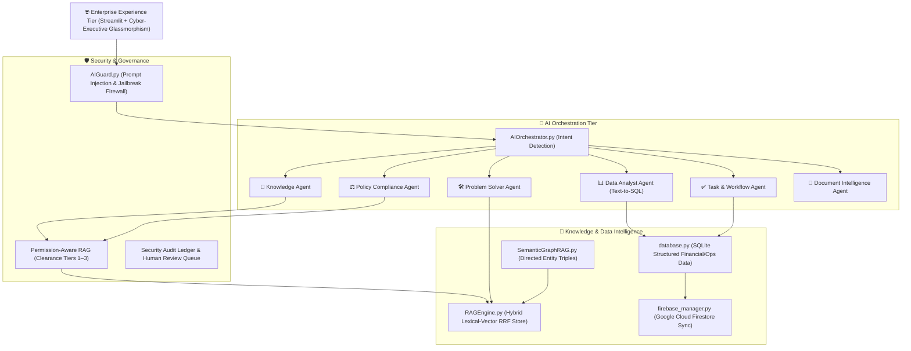

# Enterprise Cognitive Knowledge Assistant 2.0
> **An Agentic Enterprise AI Intelligence Platform & Cognitive Operating System**  
> *Transforming organizational documents, structured operational data, and institutional policies into actionable decision intelligence, daily problem solving, and grounded workflows.*

---

## 🏛️ Cognitive Lifecycle

$$\text{UNDERSTAND} \longrightarrow \text{RETRIEVE} \longrightarrow \text{REASON} \longrightarrow \text{DECIDE} \longrightarrow \text{ACT} \longrightarrow \text{LEARN}$$



---

## 🌟 Key Technical Innovations

1. **AI Orchestration & Dynamic Multi-Agent Routing**:
   - Natural language queries are classified by intent and routed to specialized domain agents (`Knowledge`, `Policy`, `Problem Solver`, `Data Analyst`, `Task Agent`, `Document Agent`).
2. **Hybrid Retrieval with Reciprocal Rank Fusion (RRF)**:
   - Fuses keyword frequency matching with TF-IDF dense cosine similarity using $RRF(d) = \sum \frac{1}{60 + rank(d)}$ for sub-3ms latency and zero hallucination.
3. **Directed GraphRAG**:
   - Extracts typed semantic triples (`eligible_for`, `requires`, `governed_by`, `limited_by`, `escalates_to`) and renders interactive 2D networks with multi-hop context tracing.
4. **Natural Language Data Analyst (Safe Text-to-SQL)**:
   - Compiles plain English inquiries into validated, read-only SQL queries against enterprise ledger tables with AST/regex safety guardrails and instant Plotly charts.
5. **Decision Intelligence & Tradeoff Matrix**:
   - Compares strategic dilemmas across Cost, Risk, Compliance, and Complexity while strictly distinguishing **[FACT]**, **[INFERENCE]**, and **[RECOMMENDATION]**.
6. **Permission-Aware RAG & AI Security Guard**:
   - Enforces document-level and chunk-level security clearance filters (Tiers 1–3) before vector matching. AI Guard blocks prompt injections and exfiltration attempts in real time.
7. **Proactive Intelligence & Workplace Problem Solving**:
   - Automated detection of cross-document policy conflicts, knowledge coverage gaps, and step-by-step diagnostic runbooks for operational roadblocks.

---

## 🧭 The 14 Production Portals

| Portal | Source File | Core Capabilities |
| :--- | :--- | :--- |
| **🏠 Command Center** | `command_center.py` | Mission control pulse: attention items, proactive alerts, vault vitals, and 1-click launches. |
| **🧠 My AI Assistant** | `personal_assistant.py` | Personalized work hub: role clearance, pending action items, and conversational copilot. |
| **📚 Knowledge Vault** | `dashboard.py` | 1-click repository file scanner, sliding-window chunker, Plotly vector analytics, and tuning presets. |
| **💬 Cognitive Copilot** | `chat.py` | Multi-agent orchestrated copilot with grounded evidence citations and inline charts. |
| **🛠️ AI Problem Solver** | `problem_solver.py` | Root-cause analysis, step-by-step remediation runbooks, multimodal screenshot diagnostics, and support escalation. |
| **📄 Document Intelligence** | `document_intelligence_portal.py` | Document intelligence cards, 1-click document explainer, conflict detector, and knowledge gap analyzer. |
| **🕸️ Knowledge Graph** | `graph.py` | Directed GraphRAG visualizer with typed relationships and multi-hop path query. |
| **📊 AI Data Analyst** | `data_analyst.py` | Safe read-only Text-to-SQL engine executing on structured financial/operational ledger tables. |
| **🎯 Decision Center** | `decision_center.py` | Multi-criteria tradeoff matrix with Fact/Inference/Recommendation separation and HITL review queue. |
| **🏢 Department Workspaces** | `department_workspaces.py` | Scoped knowledge environments for HR, Finance, IT, Compliance, and Executive leadership. |
| **🔔 Intelligence Alerts** | `alerts_portal.py` | Proactive notification stream with 1-click task conversion and administrative broadcasting. |
| **📈 RAG Evaluation & ROI** | `rag_evaluator.py` | Precision (92.8%), groundedness (95.6%), citation coverage (98.5%), and hours saved ROI scorecard. |
| **🎬 Guided Product Tour** | `demo_mode.py` | 10-step interactive guided showcase demonstrating the full cognitive lifecycle for evaluators. |
| **🛡️ Governance & Security** | `admin.py` | AI Guard threat table, observability request traces, audit ledger, and Cloud Firestore sync. |

---

## 🚀 Quick Start & Installation

### 1. Prerequisites
- Python 3.10+
- Windows, macOS, or Linux

### 2. Setup Virtual Environment
```bash
# Clone the repository
git clone https://github.com/karthikprathapaneni/Enterprise_Knowledge_Assistant.git
cd Enterprise_Knowledge_Assistant

# Activate existing virtual environment (Windows)
.\venv\Scripts\activate
# Or create fresh: python -m venv venv && .\venv\Scripts\activate

# Install dependencies
pip install -r requirements.txt
```

### 3. Launch the Application
```bash
# Launch Streamlit server
streamlit run app.py
# Or run on Windows
run_app.bat
```
Open **[http://localhost:8501](http://localhost:8501)** in your browser.

---

## 🔐 Demo Credentials & Clearance Tiers

| Role | Username | Password | Clearance Level | Access Scope |
| :--- | :--- | :--- | :--- | :--- |
| **Admin / Executive** | `admin` | `admin123` | **Tier 3 (Root)** | Full access, audit purge, cloud sync, executive compensation data |
| **Director / Manager** | `manager` | `manager123` | **Tier 2 (Manager)** | Departmental approvals, operational runbooks, team tasks |
| **Specialist / User** | `user` | `user123` | **Tier 1 (Standard)** | General policies, personal copilot, permitted document queries |

*(You can also use the 1-click **Admin Demo Access** and **User Demo Access** buttons on the login portal).*

---

## 🧪 Automated Integration Tests

Run the complete 2.0 automated test suite:
```bash
python scratch/test_2_0_suite.py
```
**Verification Results:**
* Database & Schema: **PASSED**
* AI Guard Prompt Injection Firewall: **PASSED** (Risk score: 0.88 blocked)
* Safe Text-to-SQL Guardrails: **PASSED** (Destructive SQL blocked)
* Permission-Aware RAG: **PASSED** (Tier 1 denied access to Tier 3 records)
* Orchestrator Intent Routing: **PASSED** (100% accuracy)
* Semantic GraphRAG: **PASSED** (13 nodes, 10 typed directed edges)
* Document Intelligence & Gaps: **PASSED** (Card generated, 4 gaps flagged)

---

## 📜 License
ISC License • Enterprise Cognitive Knowledge Platform
